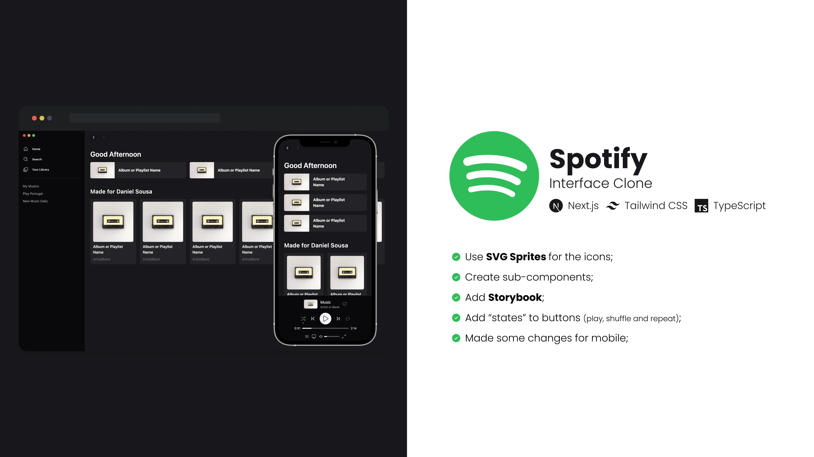
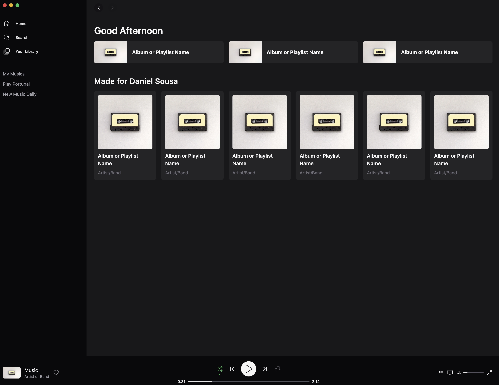
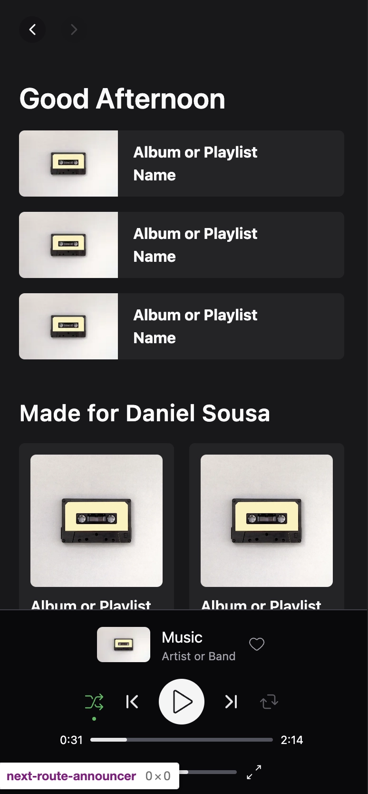
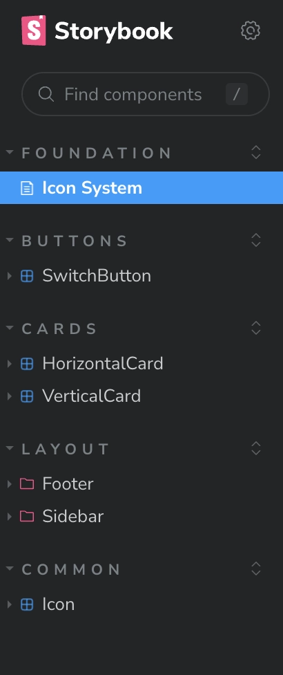
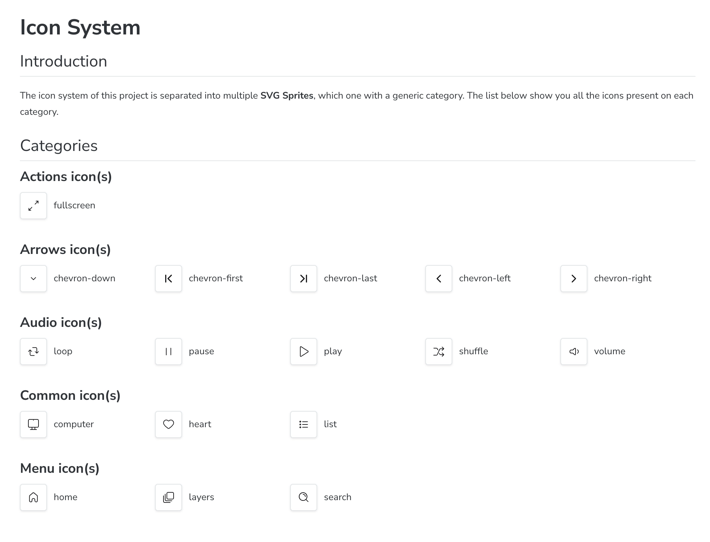
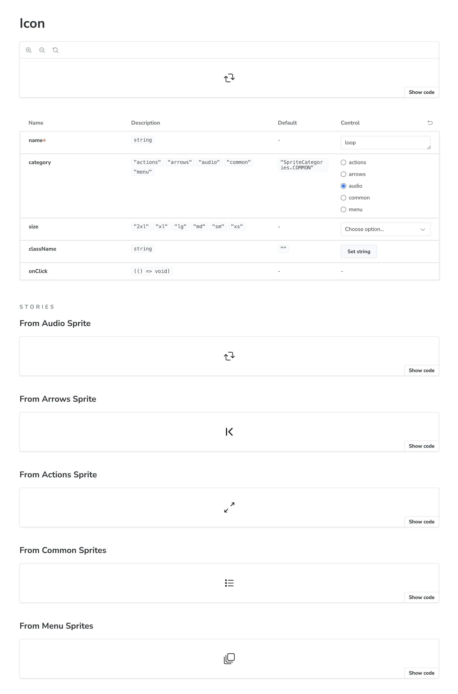
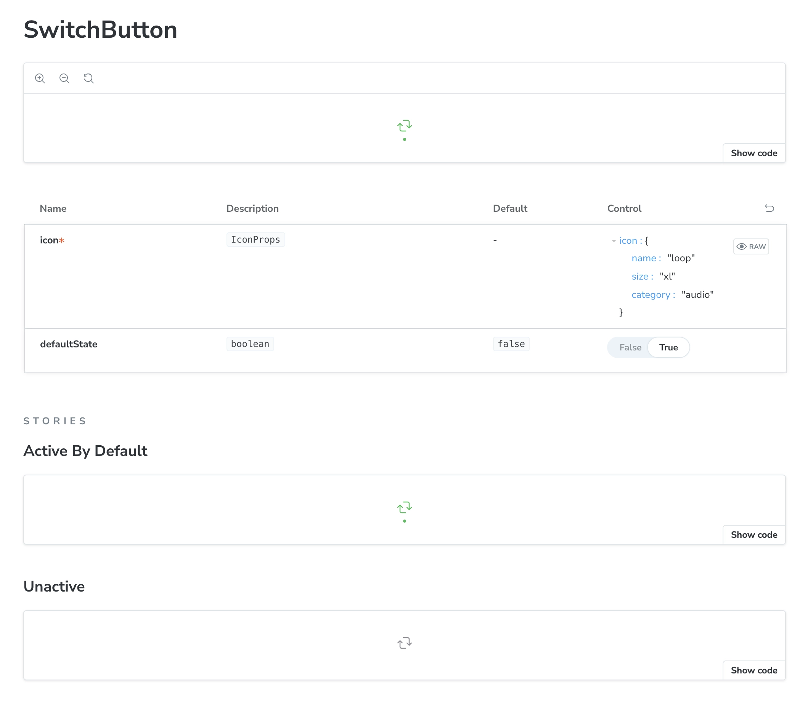

# Tailwind CSS Spotify

This repo contains the code following the [**Rocketseat** video][video] cloning the **Spotify** interface using **TailwindCSS** and **Next.js**. **Link below**👇

[![youtube][youtube]][video]

As usually, on this repo you can find some changes when compare with the course project.

## 🛠 Skills

![nextjs][nextjs] ![tailwindcss][tailwindcss] ![typescript][typescript]

## 📄 Changes

- [x] Use SVG Sprite for the icons;
- [x] Convert static assets from `.png`/`.jpg` to `.webp`;
- [x] Create components and add some interactions on buttons;
- [x] Add **StoryBook** and `.stories`;
- [x] Add **ESLint** config.;
- [x] Add **Prettier** config.;
- [x] Add **commitlint**;
- [x] Add **Husky** and **LintStaged** to add commit hooks.

### Improvements/To Do List

- [ ] Use my custom **ESLint** config;
- [ ] Improve mobile version;

## 🌃 Gallery

Desktop Version

Mobile Version

Storybook

## 🔗 More About Me

[nextjs]: https://img.shields.io/badge/nextjs-1C1C1F?style=for-the-badge&logo=next.js&logoColor=white
[tailwindcss]: https://img.shields.io/badge/tailwindcss-1C1C1F?style=for-the-badge&logo=tailwindcss&logoColor=white
[typescript]: https://img.shields.io/badge/typescript-1C1C1F?style=for-the-badge&logo=typescript&logoColor=white
[youtube]: https://img.shields.io/badge/youtube-F04264?style=for-the-badge&logo=youtube&logoColor=white
[video]: https://youtu.be/YVI-q3idGiM
